 

# Differentiating Design Aesthetics 
### An NLP Classification Project | Dana Rausch 

## Business Problem  

Understanding a customer is crucial to any business; including understanding a customer's interests and expectations when they visit a website. This becomes complicated when dealing with search terms that have little definitive bounds such as design aesthetics. One person's perception of an aesthetic may be completely different than another's - how are companies like Etsy or Pinterest supposed to account for these perceptions and return adequate search results? 

First, it's important to understand where customers perceptions are being formed. Maybe they saw an Instagram post tagged with #BohoChic, or read an article by their favorite blogger who just added shiplap to their bedroom for a Farmhouse style. Aggregating these touch points to create a source of truth is the first step in creating a model that understands what key words people will be expecting to see when searching for a design aesthetic. 

After creating this source of truth, setting a baseline of current performance is important. Do current search results match our source of truth?

## Data Overview 

An inital Google Trends analysis showed three top design aesthetics that have recently risen to peak popularity. Operating under the assumption that aesthetics just now reaching their peak popularity are less understood than aesthetics that have been around for quite awhile, this project focuses on these aesthetics. 

1. Mid-Century Modern

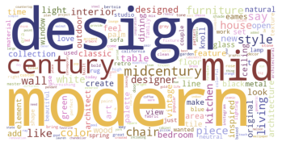

2. Boho-Chic

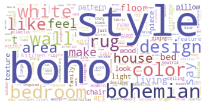

3. Farmhouse 

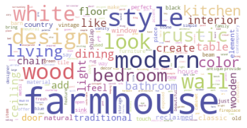

Text data was collected on these three design aesthetics by webscraping popular design blogs and publications. These articles were then broken into paragraphs for analyzing. 

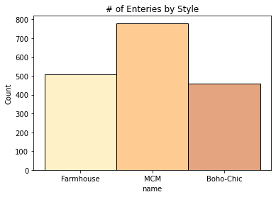

## Methodology & Results 

After an initial cleaning of the data, only nouns and adjectives were kept for the final models as these words proved to be much more important in training a model to identify design aesthetics. This should also help to bridge the gap between creating a source of truth using articles and presenting the model with product descriptions from a retail site. 

As we can see in the chart below, a straight word count is not helpful for this project. Words like "room," and "space" don't have much descriptive influence.

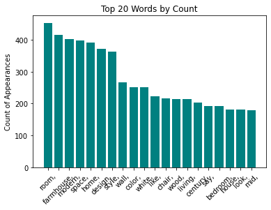

Using a TF-IDF vectorizer provided a prioritization of text that helped to train a classification model without having to collect more data. At this point, all words other than nouns and adjectives were also removed from the corpus. The bar chart below, made using feature importances after modeling, clearly shows that words with the most importance are different than words with the highest count. 

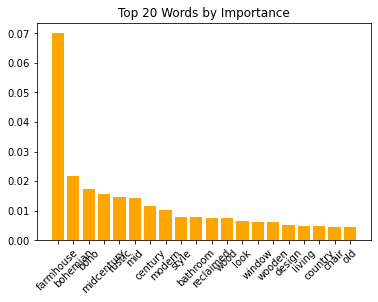 

A Multinomial Naive Bayes classification model was used for this project and recall was prioritized as search results not matching a customers criteria would be better than losing sales due to products not being included in the search. Below we'll discuss model iterations as well as performances of each class. 

First, articles were taken as a whole and used as a single document, however this resulted in skewed performance across classes as the TF-IDF vectorizer was not returning valuable importance values. (This is because the inverse document frequency was not proportionate to term frequency due to few, but lengthy, documents.) The confusion matrix below shows the skewed performance between the three classes. Next, we'll talk about how this was improved upon. 

Recall by class: 
MCM: 100%  |  Boho-Chic: 29%  |  Farmhouse: 57% 

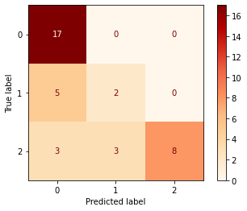

Breaking down articles into paragraphs greatly improved the performance for the Farmhouse aesthetic, while having a slightly opposite affect on the other two classes. This model is an improvement on the total recall score (from 62% to 70%), and it's clear the underlying data for Boho-Chic needs to be looked at. 

Recall by class: 
MCM: 97%  |  Boho-Chic: 27%  |  Farmhouse: 83% 

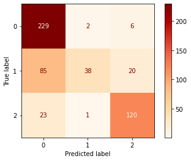

As noted above, Boho-Chic does not perform as well as the other two classes in any of the models. In fact, it often performed worse than random chance guessing. In an effort to understand why the model has difficulties classing Boho-Chic, I took a look at twenty words with the highest feature importance in the corpus and their distribution within each class. It's clear that Boho-Chic has the fewest words with high importance, making it very difficult for the model to correctly class these documents. 

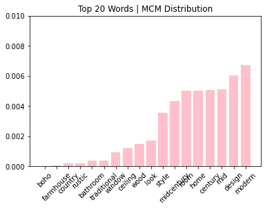 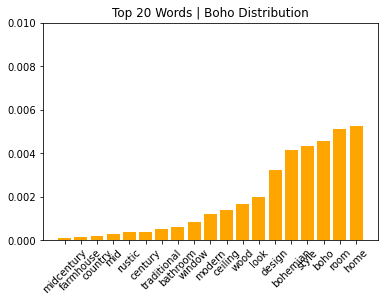 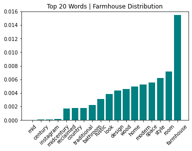

After creating a source of truth and using it to train a classification model, Etsy product data was passed through to get a general idea of how well Etsy product descriptions match the source of truth. Because our model needs more training on Boho-Chic, only products tagged as MCM or Farmhouse were introduced to the model. 
Mid-Century Modern performed well with 92% of products recognized as the correct class while only 28% of Farmhouse products were correctly classed. This could mean that Farmhouse product descriptions could use some work in order to be recognizable as Farmhouse to customers.  

## Recommendations & Future Work 

##### Recommendations: 
1. Refined Search Results: Improve search results by implementing source-of-truth classification
2. Product Tag Recommendations: Recommend product tags for sellers based on product descriptions, or recommend buzzwords for descriptions when tags are chosen first 
3.Centralized Source-of-Truth: Resources for sellers to familiarize themselves with different aesthetics allowing for better product descriptions and potentially more sales

##### Future Work: 
1. Improve Boho Recall: Gather more quality, descriptive text data that will add to overall quality and feature importance 
2. Expand Aesthetics: Train model on additional design aesthetics such as Art Deco and Minimalism 